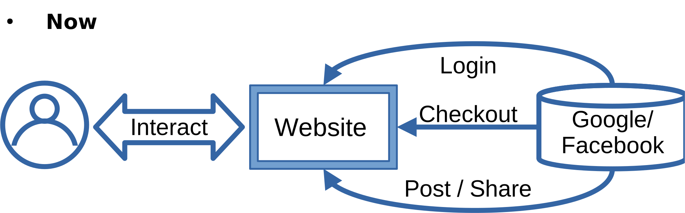
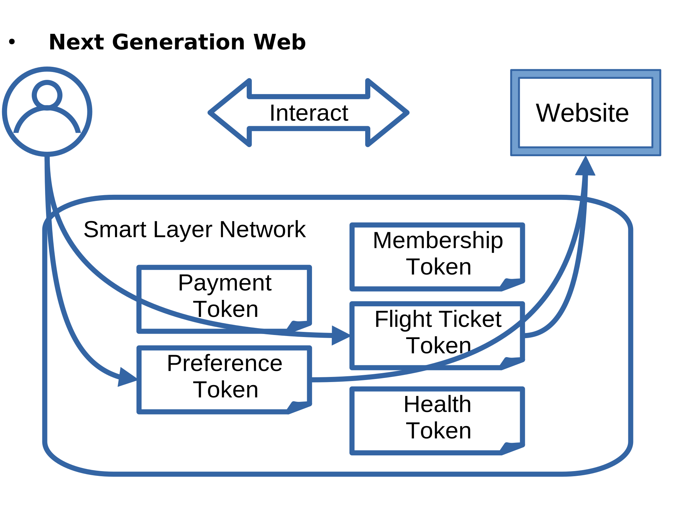
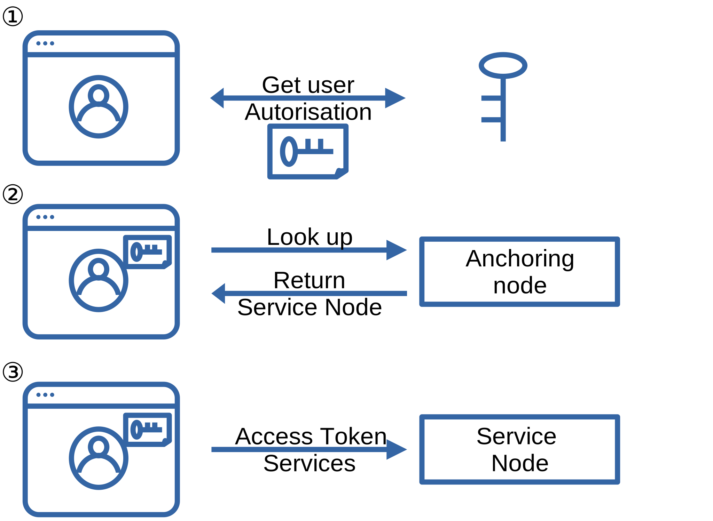
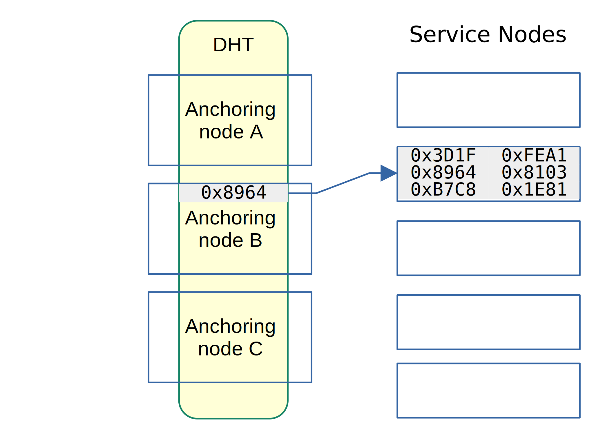
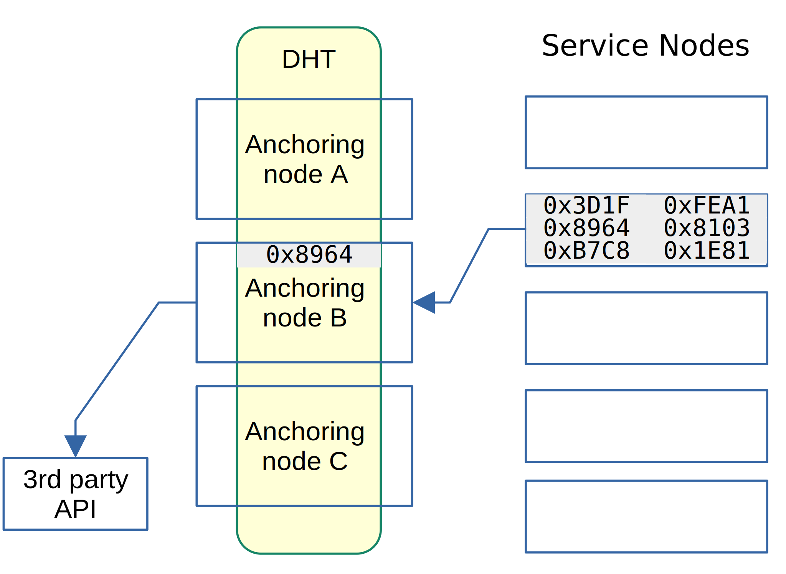

# Introduction

The evolution of the web has been marked by periods of rapid innovation, leading to an era of unprecedented connectivity and information exchange. Observations of tech giants like Google have underscored the potential benefits of integrated services. However, despite these advancements, the broader web landscape has remained fragmented. Centralised entities have emerged as dominant forces, creating isolated ecosystems that limit true integration. While blockchain technology introduced a new paradigm emphasising decentralisation and trustless transactions, its primary focus has been on asset tokenisation.

In this context, Smart Layer emerges as a decentralised protocol that aspires to redefine the web's architecture. Envisioned as an integration bus, Smart Layer facilitates seamless interactions between diverse services, akin to how websites today leverage platforms like Google for a myriad of functionalities. Beyond acting as a mere bridge, Smart Layer introduces the concept of Smart Tokens. These are tokenised digital rights and products/services that can be seamlessly integrated across various web use-cases, transcending the limitations of centralised systems and leveraging the strengths of blockchain. This protocol is designed to function as a distributed network, serving as the backbone for the next generation of the web.

Integral to the functioning of Smart Tokens within the Smart Layer is TokenScript, an OASIS standard work in progress. While Smart Layer provides the infrastructure and environment, TokenScript outlines how these smart tokens should be packaged, distributed, referenced, composed, and executed and ensures smart tokens operate optimally within the defined parameters of trust, interoperability, privacy and security. A part of TokenScript called Service TokenScript is executed in the Smart Layer network. 

# Problem Statement

For all its advancements, the modern web grapples with a fundamental challenge: the 'Limit of 3' problem. Despite the web's inherent nature of integration, most websites today are confined to three primary types of integrations: login, social media posting, and checkout. This limitation stems from a combination of privacy concerns, integration costs, and the absence of a secure, privacy-preserving mechanism to facilitate expansive integration.

Moreover, the web's fragmented nature has led to fragmented user experiences. Consider the example of a flight ticket. In the current web paradigm, this ticket, while representing a token of value within its issuing platform, remains isolated. The potential for this ticket to integrate with other systems - updating travel statuses on social media, guiding users via mapping services, or communicating flight changes to hotel booking systems - remains largely untapped. Such straightforward integrations, though long overdue, are hindered by the web's compartmentalised structure, where centralised entities offer piecemeal solutions.

This state of affairs underscores the need for a paradigm shift, a move towards a more dynamic and interconnected web ecosystem. 

# Proposed Solution: The Smart Layer Approach

The key to overcoming the pitfalls of centralisation and reigniting stalled web innovation lies not in constructing new isolated systems that don't use integrated services provided by central entities. Instead, the focus should be on establishing a decentralised integration bus.

Before the advent of blockchain technology, creating such an integration system was infeasible. Any entity operating it would inevitably become a new central trust anchor. However, the emergence of public blockchains, like Ethereum, has changed the game. They introduced smart contracts that can be executed securely, offering a trust foundation that doesn't rely on the goodwill of centralised parties.

Yet, the secure execution of smart contracts alone isn't sufficient to drive the integration needed for the next-generation web. While smart contracts can define and enforce rules, they don't actively perform tasks. They won't notify a user's mobile phone about a delayed flight or interface with a healthcare system to update a recent diagnosis. These are functionalities expected from a highly integrated web that offers a seamless user experience. To bridge this gap, we need an active "worker" built atop smart contracts. This is where the Smart Layer network comes into play.

## Smart Tokens: The Heart of Integration

Central to the Smart Layer's architecture are Smart Tokens, tokenised representations of digital rights and services. These tokens are not mere placeholders; they are based on blockchain smart contracts and enable fluid integration across diverse web scenarios, challenging the constraints of traditional centralised systems.

While directly replacing established systems like Google Login or Apple Pay with their smart token counterparts might seem impractical given the ubiquity of these services, the true value of Smart Tokens lies in their potential for innovation. The diagram showcases the myriad of smart tokens that can be crafted using the synergy of TokenScript and the Smart Layer network. Instead of a blanket data reveal, users can selectively deploy these tokens, maintaining control over their digital interactions. Notably, unlike dApps, these tokens are not designed to replace Web2 but to coexist and enhance the web2 ecosystem. Traditional services like Google Login or Apple Pay remain accessible, but innovations like the smart flight ticket carve out new avenues for web evolution.

With Smart Layer, users navigate with an arsenal of smart tokens, each tailored for specific applications, thereby unlocking a realm of untapped potential. The end goal is a web that's dynamic, interconnected, and pivots around user agency.

# Protocol Requirements

The design and functionality of Smart Layer are driven by specific protocol requirements tailored to enable the unique capabilities of smart tokens. These requirements are not merely a reflection of standard practices for distributed networks but are intricately linked to the challenges and goals of the Smart Layer ecosystem. The key areas of focus include:

- **Authenticity**: The integrations should be able to verify the authenticity of the result of the Service TokenScript code executed on the smart layer network, and the network shouldn't rely on the integrations verifying this alone for operational integrity.
- **Serviceability**: This encompasses continuous uptime, redundancy, and load balancing. While mature industrial technology can meet these requirements, their application within Smart Layer is influenced by other interconnected requirements.
- **Privacy and Security**: Smart tokens distribute their logic between user agents (like decryption of sensitive data) and server-side logic (such as triggers set within the tokens). This paper primarily addresses the server-side logic executed by the Smart Layer network.
- **Token Lifecycle Management**: This pertains to the management of smart tokens throughout their existence. Considerations include the duration a flight ticket smart token resides on a node and the mechanisms to reinstate tokens that are in dormant states, such as a car-insurance token awaiting activation.
- **Inter-node Collaboration**: Nodes within the Smart Layer network are expected to work together to facilitate specific token functions. For example, a smart car token's status could be influenced by its registration, insurance, and maintenance tokens, potentially managed on different nodes. Integrations expect smooth interactions between nodes, allowing them to concentrate on the capabilities provided by smart tokens rather than managing their intricacies.
- **Incentive Structure**: The cost of operating a token is typically borne by the integration. For instance, if a health token is used by a website to optimise a user's shopping list, the e-commerce platform incurs the cost. However, token issuers play a pivotal role in ensuring the availability and operability of their tokens on the network. They must incentivise the network to maintain the token's availability, even as the actual operation costs are met by integration points.

It is essential to differentiate these requirements from those of TokenScript. While TokenScript outlines how smart tokens should be packaged, distributed, and executed, Smart Layer emphasises the real-time execution of the server-side components of these scripts. This ensures they function optimally within the defined parameters of privacy, secure storage, and cost accounting. The features specific to TokenScript, currently under standardisation in collaboration with OASIS, are not covered in this document.

# Smart Layer Architecture

Smart Layer's architecture is rooted in mature protocols and algorithms that have been proven effective in distributed systems, including blockchain itself, distributed hash table, load balancing and service level objective monitoring, and the use of Merkle tree in data integrity verification. These foundational technologies provide the basis for building Smart Layer as a robust, decentralised network tailored for token operations. The innovation primarily stems from the creation of an integration service platform and a conducive environment for smart tokens, encouraging existing web infrastructure to transition towards a token-centric architecture.

The primary serviceability requirement determined that the network cannot be built like a blockchain, where consensus serves to determine truth; instead, services must be monitored and load-balanced in real time. This leads to the need for anchoring nodes.

## Anchoring Nodes and Distributed Smart Token Instances

Smart Layer's emphasis on serviceability sets it apart from traditional blockchains that lean heavily on consensus mechanisms. This focus demands real-time monitoring and load balancing, which is where anchoring nodes come into play. These nodes serve as the network's guardians, ensuring consistent service availability and stepping in for pivotal operations. The Distributed Hash Table (DHT), shared among these anchoring nodes, is instrumental in determining which node is responsible for a specific smart token instance. This decentralised approach not only mitigates potential attacks that might arise from matching node IDs with token IDs but also guarantees prompt responses to integration queries.

An integration, which is to say, a website and its browser session combined, access anchoring nodes to get access to the service nodes of the token the user decided to use in that integration.

The anchoring nodes, working with their peers, maintain a distributed hash table to find service nodes for any given smart token.

## Token Status Propagation and Execution

Smart tokens, as envisioned in the Smart Layer network, have a dynamic status that can be influenced by various factors. These factors can range from attestations to smart contract updates and node messages. While some of these updates are deterministic, others can be non-deterministic, leading to potential complexities in the network's operation.

### Deterministic vs. Non-Deterministic Status

A deterministic status update is one that, given the same input, will always produce the same outcome. For instance, with a flight ticket as a smart token, a flight delay leading to an automatic lounge access reward for a passenger is deterministic. However, not all updates are so straightforward. Consider the scenario of the same smart token rebooking a hotel through a web API. The outcome might be a successful booking attestation, a timeout, or even a server-side error. Such non-deterministic outcomes present challenges, especially when integrating with existing Web2 systems. While there are pure blockchain-based solutions that completely do away with the status branching, such as rebooking through hotel smart contracts backed by a hotel's precommitment, the integration of web2 systems with smart contract-enabled platforms will remain a challenge for the foreseeable decade.

## Execution Verification

In the Smart Layer network, the primary objective of execution verification is to ensure the integrity of the services provided to integrations. It's crucial to understand that this verification process is not a duplicate of validating the execution of the core logic of the smart token contracts. Instead, it focuses on the accuracy and trustworthiness of providing integration services to integrated systems.

To illustrate with a real-world smart token use-case, imagine a smart car that breaks down on the road, and a smart insurance token is at work. Execution verification ensures that the driving data is accurately passed to the roadside assistance company. It doesn't concern itself with whether the insurance payout due to the breakdown is calculated correctly - such core token logic can be part of the insurance Smart Contract, and its trust is derived from the underlying blockchain. Consequently, a potential exploit in the execution verification of any Service TokenScript would more likely target integrated systems rather than attempt to manipulate smart contract payouts.

With this context in mind, anchoring nodes in the Smart Layer network are tasked with verifying the execution of Service SmartTokens. This introduces several protocol requirements:

1. Inputs to the Service TokenScripts should be structured as valid attestations and safeguarded against replay attacks and misuse in inappropriate contexts.
2. Failures of service nodes in obtaining such attestations must be verified by anchoring nodes to prevent false claims of failures of the integrated systems.
3. The output resulting from token execution should be attested, offering proof of the operation's authenticity.

Let's delve into these requirements:

### Inputs must be attestations

To bolster the integrity and authenticity of data inputs, they should be framed as attestations. These cryptographic proofs validate the legitimacy of specific data or actions. Mandating inputs as attestations ensures that only authenticated and verified data drives token operations, enhancing the security and reliability of the Smart Layer network.

### Handling Failures

When a node falters in its execution responsibilities, anchoring nodes intervene. They can either mediate disputes or reassign the smart token to a more dependable node. Only anchoring nodes can issue attested failures. Their primary role is to provide attestation for the failure to secure necessary attestations, propelling the token to its subsequent state.

### Attested Execution

Trusted Execution Environments (TEEs), such as Intel's SGX, offer a secure milieu for code execution, safeguarding data confidentiality and integrity. Leveraging TEEs facilitates attested executions, where computation results are paired with proof of correct execution.

Service Nodes must execute all Service TokenScript within TEEs verifiable by anchoring nodes and integrations. This stands as our primary mode of execution verification.

#### Security

While TEEs, including SGX, have encountered vulnerabilities, they remain unparalleled in ensuring trusted execution without overburdening the design with consensus protocols. Large commercial entities, like Microsoft's Azure, have embraced TEEs, reinforcing confidence in the technology. However, the system should be equipped with alternative execution verification fallbacks in case of vulnerabilities. These fallbacks, activated by a DAO emergency vote, range from partial (load-balancing nodes across different platforms) to full (routing all service node traffic to anchoring nodes for selective computation verification).

#### Performance

TEEs, such as SGX, have limitations on computational power utilisation. In practice, node operators might offset this by running parallel tasks like mining. Future TEE iterations aim to optimise resource allocation and advancements like parallel execution, and Enhanced Memory Management promises near-full system resource utilisation for Service TokenScript execution.

### Periodic Execution Monitoring

Anchoring nodes are mandated to periodically oversee the execution of Service SmartTokens. This continuous monitoring regulates the staking mechanism, allowing for stake slashing upon detecting execution discrepancies. Service nodes are periodically prompted to provide execution samples for validation. This mechanism is akin to immune cells inspecting protein synthesis within biological cells, ensuring operational integrity.

In fallback mode, execution monitoring is performed by selectively redoing the execution, relying on all service nodes to route traffic to anchoring nodes, effectively transforming them into gateways.

## Real-World Application: The Flight Ticket Smart Token

To better understand the intricacies of the Smart Layer network, let's delve into a real-world example: the flight ticket smart token.

### Read-Only Access

Imagine the user booked a car rental at the rental website, using the smart token on this website. This creates an authorisation for the car rental to access the flight ticket smart token interfaces. When the car rental service wants to verify if your flight is on time, any node that has this smart token instance can provide a read-only API to share the flight's current status, and the selection of the node is largely a matter of load balancing. This process is facilitated by any of the nodes where the smart token is instantiated and selected at random.

### Single Execution by Elected Node

Now, consider a significant flight delay. This delay might trigger the smart token to rebook your hotel reservation. Since this action interacts with the external world and can have financial implications, it is crucial that only one node executes it. Once the rebooking is successful, the hotel system might generate a new booking attestation, confirming the change.

However, what if there's a failure? What if the node trying to rebook the hotel faces multiple timeouts when accessing the hotel's API? After a set number of failures, from the network point of view, an event occurred that the token failed to move to the next state. The traffic to the hotel system API would be rerouted through the anchoring node that elected the original executor. This anchoring node can then verify server timeouts or other errors and provide a failure attestation to move the smart token to the next state. Frequent routing of this nature triggers service level agreement to scrutinise the node that was responsible for execution.

While the flight ticket smart token serves as a tangible example, it is essential to understand that the Smart Layer network is not limited to this application. The principles discussed here apply to a myriad of potential smart tokens, each with its unique challenges and solutions.

## Attestation Gossiping and Queuing in Smart Layer

In the Smart Layer architecture, the dynamic status of smart tokens is predominantly updated through attestations. These attestations, essentially cryptographic proofs, vouch for the validity of a particular state or action. Given the decentralised nature of the system and the real-time requirements for token status updates, there arises a need for an efficient mechanism to disseminate these attestations across the network.

### The Need for a Hybrid Mechanism

Traditional gossip protocols, inspired by the way information (or gossip) spreads in social networks, have been a staple in distributed systems. They ensure that data is disseminated quickly and efficiently across a network. However, the unique requirements of Smart Layer, especially the need for ordered delivery of attestations and the ability to request missing attestations, demand a more sophisticated approach.

The unique requirements include selective gossiping where an attestation covers a type of smart tokens or a subset of smart tokens in that type, the timely update needed for integration to function, order and integrity, plus compatibility with a subscription model. This calls for a hybrid mechanism, which marries the strengths of gossip protocols with the features of systems like Apache Kafka. While gossip protocols ensure rapid dissemination, systems akin to Apache Kafka ensure that these attestations are delivered in order and allow nodes to request specific attestations they might have missed.

### How It Might Work

Imagine a scenario where an airline releases a series of attestations updating flight arrival times. Nodes in the Smart Layer network that have smart token instances depending on that flight would subscribe to these attestations. As these attestations are gossiped through the network, the Kafka-like system ensures they are received in the correct order. If a node misses an attestation, it can request that specific piece of information, ensuring data integrity and consistency across the network.

This hybrid approach addresses the challenges of both rapid dissemination and data consistency. The decentralised nature of Smart Layer presents unique challenges, and we are committed to innovating and iterating on these solutions to ensure a robust and efficient system. As we progress, we will continue to refine and adapt our approach to best serve the needs of the Smart Layer ecosystem.

## Secure Execution Environment

Given the dynamic nature of smart tokens, it is imperative to have a secure environment for executing token code. Sandboxing techniques are employed within Smart Layer nodes, allowing token scripts to run in isolated environments. This ensures that the broader network remains unaffected by potentially malicious or faulty token scripts.

# Smart Layer Token Types

The tokenomics of Smart Layer is intricately designed to ensure the sustainability, efficiency, and robustness of the network. Central to this design is the dual-token system, which serves distinct yet interconnected purposes:

## Service Token

The Service Token is the primary medium of exchange within the Smart Layer network. It facilitates all micro-transactions associated with token operations, from querying token data to more resource-intensive modifications. Integrations typically bear the costs associated with token activation, which are transacted using the Service Token. This token ensures that the network remains agile, with real-time settlements and efficient resource allocation.

## Stake Token

The Stake Token represents a stake in the Smart Layer network. Holders of this token have a vested interest in the network's growth and governance. Depending on the network's design, Stake Token holders might influence governance decisions, propose changes, or even earn rewards based on network activity. This token ensures that the network remains decentralised, with stakeholders actively participating in its evolution.

The tokenomics of Smart Layer is designed to ensure the sustainability, efficiency, and robustness of the network. It strikes a balance between incentivising token issuers, integrations, and the nodes that power the network. Here's a deep dive into the tokenomics structure:

# Service Token's Tokenomics

## Token Issuer Rent

Every token issuer pays a nominal fee termed as "rent." This rent ensures that the TokenScript associated with the token remains available on the network. Additionally, it guarantees that any smart contracts linked to the token are actively monitored. While the rent is minimal, it serves a crucial purpose: it ensures that the network remains primed for any token activations, ensuring the readiness and responsiveness of the Smart Layer.

However, this rent does not necessarily translate to a financial burden for token issuers. On the contrary, they can potentially profit from the broader ecosystem, particularly from the "business" operations, which will be elaborated upon subsequently.

## Token Activation and Operation Costs

While the token issuer pays the rent, the costs associated with token activation are typically borne by the integrations. An integration, in this context, refers to any stakeholder or entity that leverages the smart token for a specific use-case.

For instance, consider a health token. An e-commerce platform might utilise this token to optimise a user's shopping cart. In such a scenario, the e-commerce platform would cover the costs associated with accessing the token's interface. Conversely, a visa office might adopt a different approach. If an applicant provides data, such as a flight ticket in smart token format, the visa office might require the applicant to attach a small payment to cover the token operation costs.

The cost of querying token data is relatively low, facilitated through a state channel. However, modifying token data, given its reliance on gossiping and node synchronisation, is more resource-intensive and costlier.

## State Channels and Settlement

State channels play a pivotal role in the Smart Layer tokenomics. Whenever an integration interacts with a smart token, a state-channel is opened. This channel keeps track of all the micro-transactions associated with the token operations. Integrations have the flexibility to close these channels and settle the accumulated costs at regular intervals, such as monthly.

Anchoring nodes, which play a central role in the network's operation, maintain these state channels. They ensure that payments are routed correctly to the nodes that provide the services. At the end of a settlement period, the anchoring node consolidates all the transactions within the state channel and processes the payment to the respective service-providing nodes.

## Dynamic Tokenomics: Tailoring Incentives in a Decentralised Ecosystem

The tokenomics is structured in a way that allows token issuers, while paying a nominal rent, to write their token contract in a way that profits from the broader ecosystem. 

Token contracts can dictate revenue derived from various "business" operations facilitated by the smart tokens. For instance, a token issuer might collaborate with multiple integrations, each offering a unique service or benefit associated with the token. Every interaction with the token, whether it is a query or an update, translates to a micro-transaction. This is because unlike industrial smart tokens, some community smart tokens may need the cumulative value of these micro-transactions.

Furthermore, integrations, by leveraging smart tokens, can offer enhanced services to their users. This improves user experience and may open up new revenue streams for the integrations. For instance, an e-commerce platform can offer personalised shopping recommendations based on a user's health token, leading to increased sales and customer satisfaction.

# Conceptual Foundations and Further Design Considerations

## Designing for today's unthinkable, tomorrow's norm

From a protocol design perspective, it's essential to anticipate the evolution of technology and its potential use-cases. Historically, technological advancements have often rendered the previously unthinkable as standard practice. As protocol designers, it's our responsibility to ensure that the foundational layers we create can accommodate these shifts.

Take the case of Amazon. In its early days, the concept of an online marketplace without physical salespeople was a radical departure from established retail norms. Today, after transforming the retail landscape, the model it pioneered is elementary. As we design the Smart Token and its supporting Smart Layer, we must ensure that it's flexible and robust enough to support similarly transformative use cases in the future. For instance, the protocol should allow future retailers to interface with a vehicle's smart token to anticipate maintenance needs or to facilitate timely deliveries using flight smart tokens.

Similarly, how might the protocol handle scenarios where smart locks grant access based on tokenised rights? Or when smart cars, equipped with insurance tokens, autonomously initiate roadside assistance? These are not mere hypotheticals but real-world applications that builders aim to achieve based on Smart Layer.

The rise of AI user-agents further underscores the need for a robust protocol. As AI becomes more integrated into decision-making processes, our protocol supports interactions between AI-driven decisions and token interfaces. Compared to account-based integration, token-based integration reduces the attack surface by reducing the scope of integration, allowing ephemeral integrations and enhancing composability, a critical feature for future web integrations.

## The Decentralised Nature of Future Integrations

Feedback often suggests that the success of such a protocol hinges on adoption by Internet giants. However, the nature of integration is connecting everyone involved in a process. The next-generation web will likely be shaped by numerous localised innovations, each tailored to specific industries and users. As protocol designers, our focus should be on creating a flexible and adaptable foundation.

A core principle guiding the design of Smart Layer is the emphasis on creating a robust mechanism for provisioning smart tokens. Rather than getting bogged down in the specifics of individual tokens, our approach, reminiscent of the early Internet's layered design, is to ensure that more complex features can be built atop this foundational Layer.

In conclusion, while the technology we're discussing isn't a direct solution for a specific niche, it's imperative for us, as protocol designers, to think beyond the immediate. Our goal is to lay the groundwork for a future where the use-cases we've discussed, and many we have yet to imagine, can become a reality.

