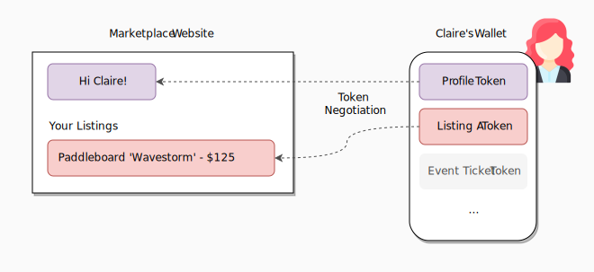

# Introduction to Token Negotiation

In a token oriented architecture, token negotiation is the initial process to enable a token to be used on a website.

It is different from the current wallet based connection model. In place of connection, there is negotiation.

Consider the prevailing connection model, the website is given a connection to the user's wallet, either directly, or through WalletConnect. Through this connection, the website learns user's address and follow up the trail in blockchain to determin what tokens he has, then update the webste based on his token ownership.

This can be compared to opening the door to the user's home and let the website discover the treasure. There is no negotiation, it's just on / off button to access all user's treausres. Furthremore, the website has to have the knoweldge where to look to find the tokens for this to work, and every token typically are functioning the same way for this to work

Token negotiation works in having your wallet with this capability to negotiate with the website on what tokens to use, by presenting users with a choice. this choice is similar to the choice presented to users on the use of cookies, except the choice was made with the wallet and the result was sent to the website. 

It not only selects the token to be used on the website, but also provides token interface data, such as which server is used to find the additional information of the token, whether the user is able to sign an authorisation for the website to seek such information. For example a movie token can inform a webste - say youtube - that with user's authorsation it is able to fetch a movie from a studio and render it for the users. 

There are a few methods for negotiation. It's possible for a website to define either the token type, such as an insurance website can define on the application page that the token of topic is that of a car ownership token. or it can define a token capability, such as any tokens that carries the capability for authorsation to send it is . this is useful for a betting website where anything can be a bet (maybe a smart car?) and loser transfer the asset to the winner. there is also action based negotiation, where the token that can be used is selected bsed on the action it can perform. a typical exmaple is if a website look for a token that can pay USDC. Any USDC generating token, such as an AAVE position, or a line of credit, is usable. There is also a negotiation where the website holds an authorisation from the token issuing entity to convince the wallet that the token was designed to be used on it, making it a quick cut.

Once the negotiation is done, the token enters the website. this means a few things

First, the token metadata is known to the website. This includes the communication methods, such as how to decrypt token data and which server to connect to to get additaionl token data.

Then, the token as an object is passed to the website, where the website can reuqest actions. An example is that a car ownership token is passed to a website where the webstie can request the car owner to authorise itself to issue new keys that can beused to drive the car.  Such functinolaities are exposed with TokenScript and using these actions causes tokenscript to be executed online (such as in smart layer network) or off line such as in user's wallets.

If you think of a marketplace service such as Gumtree or OLX on the “standard” Web, the user enters the website and finds himself in the landing page. He clicks “login” and inputs his credentials and password. The website checks this against a database and returns a profile that includes his personal data, his payment details and his sales listings. In this model, websites are directories for content as well as “banks” and gatekeepers for all user data.

On the **tokenized Web**, when the user enters the website, he immediately sees all his information and sales listings. He doesn’t need to insert his credentials. This happens through Token Negotiation, a process where a website discovers what tokens it can use from which the user has.

How? The user holds his tokenized information in his browser or mobile wallet, such as his Details Token and his Listing Tokens. When entering a tokenized website, it may ask…

- Who are you?
- What do you have?
- What do you know?

The user “answers” with his tokens and the website displays content and available action accordingly. Login becomes optional. The website might need all token information, some or none at all. The website will ignore tokens that are not useful to their system (or that they are forbidden to use). It’s up to the developer and his designed user experience.

The marketplace displays his listings and adds functionality (free shipping) for the user.

On a tokenized Web, the user holds his own tokens and websites display what he owns or provide action. The user is the "banker" of his own assets.

The marketplace may use available tokens (such as a Profile token) to enrichen the experience. It ignores unrelated tokens.

Different websites and smart contracts will ask for different data they need to work. Any system that is able to read & interpret token data may ask. For example, point-of-sale machines, highway toll booths, gate scanners, mobile apps, IoT light bulbs, and anything else.

## What tokens to use (and how)?

The issuer defines how each token is used or interpreted through the following negotiation methods:

<section data-conref="../TokenNegotiation.dita#negotiation_methods" />

When the tokens are used, the website displays content or makes actions available to the user. This can be be done automatically by the system or manually triggered by user interaction.

The website or smart contract owner may require specific information to enable his services. For example, if the user wants his listing token to appear in our Marketplace, it can determine that the token must include the “Price” and “Conditions” attribute, but that “Location” is optional.

If the user wants his Payment token to be available, the developer might determine that the token must include a “Whitelist Attestation” from a third-party provider. The website will enable payment actions accordingly.

