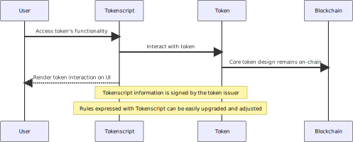

# TokenScript Design Short Paper

## Abstract

We acknowledge the potential of blockchain technology in facilitating seamless markets and integrating the next-generation web, a process we term as *tokenisation*. 

However, the current usage of tokens does not meet the prerequisites for tokenisation. The ways tokens are accessed, rendered, and transacted are dispersed across dynamic Dapps and immutable Smart Contracts on the blockchain. This leads to numerous challenges when implementing business logic in a token, resulting in either overly simplistic solutions or complex systems with security vulnerabilities and potential points of failure. 

To address this, we propose TokenScript, a programming interface for tokenisation. It abstracts token information, access methods, and UI rendering to facilitate efficient marketisation and integration. It enables different token providers to describe not only their tokens' features but also their "actions", such as transferability. The key concept is that this markup description can be updated by the token issuer at any time, retroactively affecting the behaviour of already issued tokens. This not only allows easy interoperability between different token providers but also eliminates the need to update the DApp or smart contract when the business logic of a particular type of token changes.

Specifically, TokenScript is an XML dialect. It outlines the functions provided by the token (through smart contract or otherwise), the method to render it on the user's interface, the ERCs token behaviour templates it uses, and the JavaScript needed to construct transactions and render the token. TokenScript allows token logic and rendering to be separated from the "host", making the token easily portable and markets to be created for it.

## Tokenization

Blockchain technology serves two primary functions that are essential for the future economy and the next-generation web:

* facilitating a frictionless market; and
* integrating the next-generation web.

We term this process *Tokenization*. This paper outlines our vision of where we can be and follows up with the design and architecture needed on top of the blockchain. 

### Creating a Frictionless Market

Most markets are not integrated and operate with high costs. For instance, the stock market has such significant overhead that it is only justifiable for multi-million dollar businesses that rely on the trust of rules and regulations to operate.

Nearly all markets still operate in the traditional intermediary-operated market model. A trade is made in two stages: entering the market, making a deal. With blockchain, any tokenised asset can be transacted at any time, without an intermediary. The buyers and sellers do not need to "enter" the market; instead, tokens are *always on the market*. A trade can start with the second step. 

This enables trades that the frictions of the traditional market permitted. We can tokenize 1% of a property and create granular investments of all kinds of resources. We can tokenize electricity, allowing power users to benefit from finer scheduling of the use of resources. And so much more. 

Blockchain can provide the foundational layer to achieve these. But it requires a reliable and precise method to define how tokens should be used and transacted. Tokens must be categorised into *payment* and *deliverable* tokens. The commonly used ERC represents only the payment side of a trade. Often they just serve as a gift card, replacing other payment token. 

To trigger tokenization, tokens must be products. To be so they need to have different properties: Do tokens expire? Some do, some do not. Should the token owner receive a notification on a specific event? Is it stream-able? Is it related to identity information? How does it look on the user's mobile, and how is it called in a users language? Does it define a method to establish trusted communication between buyers and sellers?

### Integrate the next-generation web

The current state of the internet is akin to a vast library, where users are like readers keeping notes of the index numbers. It's not fully integrated, and this lack of integration is not a flaw of user experience design, but rather a limitation of the web's architecture. Even smartphones, which were designed to be the most integrative and personal tools for browsing the web, have not solved this problem. In fact, they have exacerbated it, as tasks like copy-pasting become more cumbersome on a smartphone. The effort from the client side alone can't integrate a web that is not designed to integrate.

The web lacks a built-in authentication mechanism. Many users resort to add-ons like "Sign in with Facebook" to provide authentication through a trusted third party. This workaround not only raises privacy and availability concerns but is more of a stopgap than a solution. Most simple business cases don't require an account.

Another issue of web disintegration is the absence of a built-in mechanism for ownership, value transfer, and trading. Whenever ownership is involved, there needs to be a chain of bureaucratic procedures, which is pulled from account to account in the background - and each introduces another trusted third party. Accounts can hide the problems of a disintegrated web - but they don't solve them.

Both missing features - authentication and ownership - are well-known functions of the blockchain. In the next-generation web of tokenization, smart tokens are the angle that integrates the web.

## Prerequisites for Tokenization

We strongly believe that it is inevitable that Tokenization will happen and will integrate both markets and the next-generation web. But obviously, we are not here yet. There are thousands of tokens, and the ICO hype in 2017 raised billions of dollars. But Tokenization did not even really start.

To fulfill the promise, tokens need to become a lot more sophisticated. An important part is that they serve not only on the payment side but also on the delivery side. There are several prerequisites tokens must meet to enable Tokenization:

1. Complexity

Tokenization means having a large variety of tokens, each tailored for its use case, and each based on a rich foundation, structuring transaction rules, behavior patterns, and business logic.

2. Interoperability

Tokens must be able to interact with a large set of different systems, be it IoT devices, third-party websites, wallets, or other tokens and smart contracts. Tokenization only happens when tokens are embedded in this environment, while they are able to independently integrate this environment. All services, wallets, and so on must be able to understand, address, and react to every single event and action option of the token.

3. Adaptability

A token never has a finished state. It must be able to be upgraded to reflect the business environment and to adopt new protocols, like other smart contracts or plasma state channels. To be successful, tokens must not be locked into one protocol or one state, but be able to react flexibly to the environment and technological achievements. Wallets and services must be able to adopt such changes of the token in an easy and fast manner.

4. Trust

A token must carry trust relationships and business context to third parties. There are many use cases in which a token is used to transport a permission or attestation, given from one party, to another. Only this enables tokens to integrate trust-based services. This must not but can involve private data.

It should be noted that the achievement of these prerequisites must not disturb the strong basic security and trust properties of tokens based on a blockchain provides.

## The Limitations of the Traditional Token System

The traditional token system, as we understand it, is the model employed by the vast majority of existing tokens. These are typically based on an Ethereum smart contract, defined by the ERC20 or ERC21 standard. In this model, all the behavioral rules of a token are embedded in a smart contract, while users depend on hosted DApps for access to functions beyond simple transactions.

We contend that this approach is not conducive to creating a seamless market and integrating the web. Addressing the challenges associated with the traditional token model is often difficult, if not nearly impossible, while it also introduces complexity and leads to scalability, interoperability, and security issues.

*1. Interoperability*

The business logic of a token - all kinds of applications - are coded in a smart contract, and centralized websites enable users to access the contract. For instance, if you have an ERC721 crypto kitty token, you must access the CryptoKitties website to use it.

This method necessitates that designers anticipate all possible business scenarios, which adds significant complexity to the code. The level of complexity often leads to security issues, as was the case with the DAO. While this model can work, as demonstrated by MakerDAO, it usually limits the scope of rules around the token to basic payment functionality.

*2. Adaptability*

Ethereum tokens have a very limited capacity for interaction with other systems like wallets, DApps, or smart contracts. If the logic of interaction is part of the smart contract, it either increases complexity or results in security issues. To allow wallets to reflect smart contract logics not represented in the contract itself, they need to be updated for every new token. This is not scalable.

Similarly, it is challenging to enable a token to interact with other smart contracts. How can the token contract know about another contract before it is written? How can a wallet know how to let a user control this interaction?

The established solution for all cases of more complex token logics is to use a hosted DApp. For almost everyone, it is impossible to use the CryptoKitty token or participate in MakerDAO without access to the websites. The advantage of integrating the web with tokens is lost when the user needs to rely on hosted web services again.

*3. Flexibility*

Market behaviors are unpredictable. Even if a smart contract developer lays out brilliant incentives and rules for today's economy, it will not be competitive in the future if it cannot adapt. To allow tokens to become an integral part of the economy, you must update the business logic they represent.

Also, you need to adapt a token's transaction and behavioral logic to new smart contracts it can interact with and to new protocols, which are not fully written yet. For example, you might want to allow a token to be transferred with plasma sidechains.

A smart contract that can't be upgraded makes most cases for tokenization impossible. There are methods to upgrade them, but it is difficult and complex and relies on another - immutable - smart contract. As the hack of Parity's multi-sig contract showed, this can introduce security issues. In general, it increases the complexity of the contract.

*4. Trust Relationships*

Implementing trust relationships with the legacy model of tokens presents two problems: First, you will have to input private data on a blockchain, which has, even when encrypted, several risks. Second, you need to carry the relationship over a hosted DApp, which means you are dependent on a website being online. If one part of a chain of trust relationships is offline, your token will not work.

In summary: Tokens on Ethereum suffer from having their entire functionality derived from a smart contract. Some requirements of tokenization are impossible to be fulfilled with this model. Some can only be achieved at the

cost of increasing complexity and introducing security problems, which means that companies wanting to use tokens for a business case will end up struggling with smart contract development instead of developing their business. Finally, some requirements can only be achieved at the expense of reintegrating the web again by relying on hosted DApps.

Most of these limitations have one common denominator: There is a missing link between the smart contract and the user. This either depreciates the functionality of the smart contracts or reintroduces centralized hosted DApps to fill the gap.

## Tokenscript: A Proposed Solution

We introduce Tokenscript as a potential solution to address the limitations of the traditional token model. Tokenscript, or Token Behaviour Markup Language, is a programming interface designed for tokenization.

Tokenscript is an XML dialect that outlines the functions of the token and the method to interact and render it on the user interface. It serves a dual purpose: It assists users in accessing the full functionality of the token and allows for the creation of more advanced, complex, and flexible user-token interactions.

The XML dialect can be easily interpreted by any device and software without the need to integrate it into the core of the wallet structuring the interaction with the blockchain. It's also possible to use Tokenscript to perform token actions on another protocol, without the need to migrate the token smart contract. The rules expressed with Tokenscript can be easily upgraded and adjusted.

Essentially, Tokenscript offloads a significant amount of information off-chain, while the core of the token design remains on-chain and the Tokenscript information is signed by the token issuer. This makes it as verifiable as the smart contract itself, while being a set of shared data between the token issuer and its users. In the context of current blockchain terminology, it could be described as a Layer 2 technology for interacting with tokens.

Think of it like a computer program for your music files: Like the token on a blockchain, the music files remain the same, but the software for playing them can change. It can be automatically updated to eliminate a bug, or it can change to allow new features, like recording, cutting or fine-tuning the audio frequencies or organizing it in a library of your favorite songs. Tokenscript is the hinge that connects the software with the token and ensures that their interaction is not arbitrary, but structured by the issuer of the token.

To explain Tokenscript in more detail, examples are given in the full design paper.

## Design Considerations

The design considerations for Tokenscript should address the dual challenges of integrating markets and the next-generation web.

To create an integrated, seamless market, we define a *market* as a location where a transaction of payment versus delivery occurs: An individual pays with a monetary token and receives a tokenized deliverable. Tokenscript should facilitate this process seamlessly by enabling the issuers of delivery tokens to create and render an intricate business logic surrounding the token, addressing the needs of the market it integrates. Concurrently, Tokenscript should empower wallets to effortlessly comprehend, visualize, and interact with the token's logic.

### Information on Deliverables

The range of deliverable classes is limitless. For instance, consider a market for tokenized 1% property shares, which can be bought and sold across various marketplaces. For such a token, the buyers acquiring the token require a wallet that can display and respond to a broad array of information. We categorize this information into four classes:

1. Product Description: Voting rights of the property, payout specifications of proceeds, conditions for liquidation in case of collateralization of the property, and so on.
2. Attested Information: Location and status of the property, legal state of ownership, identity information.
3. Reference Information: Performance of property in this area, historical sales.
4. Action Information (how to perform an asset action): How to construct a transaction to acquire the property? How to vote with your share, how to sell it or offer it on a market?

Tokenscript should enable issuers of deliverables to integrate and render these classes of information while empowering wallets to understand, visualize this information, and transform it into appropriate transactions.

### Information for Payments

Similarly, with the advent of programmable money like Ether or DAI-Dollar, there are opportunities on the payment side. There can be automated payments, automated cashbacks and affiliates, advanced multisig payment and escrow schemes, payments with attached attestation information, automated exchange of tokens, management of collaterals when using stablecoins like tokens, and much more.

Like the deliveries, the payment requires wallets to understand the context and business logic of a payment to craft the correct transaction. This necessitates wallets to evolve beyond their current capabilities. They must learn, visualize, and utilize the underlying logic of complex payment operations.

To empower wallets to exploit the potential of programmable payment tokens, Tokenscript should process similar information categories as on the delivery side.

### Potential Benefits

Tokenscript can yield substantial benefits in several areas: Interoperability, Scalability, Security, Privacy, User-Interface, and Availability.

#### Interoperability

Tokenscript enables a token to maintain or adapt its underlying business logic to be compatible with various applications and wallets. It serves as a tool to imbue tokens with intricate business logic and ensure compatibility with platforms, wallets, or websites, even when updates occur. This applies to logics on the payment side as well.

#### Scalability

Scaling Ethereum necessitates the use of second-layer technologies like Plasma Sidechains. Tokenscript facilitates the retrieval of information about the token - and the chain on which it operates - without needing a node that runs on all possible chains. It also coordinates payment processes where the payment token is not on the same chain as the delivery token.

#### Security

Often, it's challenging for users to understand the content of a transaction they sign. As transactions represent more complex transaction logics, it becomes difficult for wallets and users to fully comprehend what they sign. Ultimately, users need to place their trust in the website. With Tokenscript, the level of required trust is reduced to the issuer of the Token.

#### Privacy

Certain token business cases, like the purchase of a property share, could require the user to provide proof of identity. Without a tool like Tokenscript, it's challenging to do this without giving private data to a trusted third party, which is not directly part of the transaction but coordinates it. Tokenscript can instruct the wallet on how to send this data directly to the party needing it.

#### User-Interface

The complexity of transaction and token logic makes it challenging for wallets to represent and update it. Imagine having 1000 tokens with 1000 individual business logics. Should the wallet developer integrate each one? Should the smart contract ABI cover every wallet or website implementation? Tokenscript markups allow wallets and other services to represent a rich set of information about a token, extend it with external information, implement action buttons, and update the token logic.

#### Availability

In most cases, complex token logics - for example, Crypto Kitties - are accessed by a hosted DApp. This reintroduces the dependencies that blockchain was meant to eliminate. It also introduces the integration through servers in the middle when the token logic allows integrating several parties, like using a car ownership token as an insurance token and a membership token for the road service. In this model, the user is dependent on the availability of a certain server. With Tokenscript, this can be bypassed, so that the use of a token does not rely on a single source of failure.

## In conclusion

In conclusion, the advent of smart tokens and the application of Tokenscript presents a transformative approach to the next-generation web. This technology not only enhances the functionality and interoperability of tokens but also addresses critical issues such as scalability, security, privacy, and availability. 

As we continue to explore and innovate in this space, the potential of Tokenscript and smart tokens will undoubtedly unfold further. They will play a pivotal role in shaping the future of digital transactions, paving the way for a more integrated and frictionless market. 

