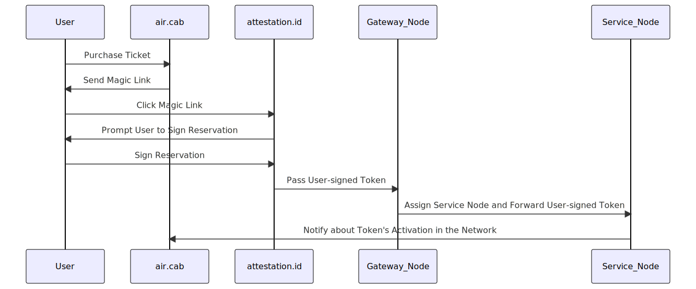

# air.cab use-case guide

This guide uses an imaginative airline air.cab to demonstrate how smart tokens are created.

## Introduction:

We assume a token issuer, air.cab, a regional airline issuing tickets as smart tokens. The process involves several parties:

air.cab
: The token issuer that issues smart token airline tickets, typically on identifiers like the user's email address.

attestation.id
: The identifier attestation issuer that also operates a PWA for authenticating and authorising using the attested web2 ID.

Smart Layer Gateway Node
: The node responsible for assigning a service node. This is a work in progress and the role might merge with the archive node in the future.

Smart Layer Service Node
: The service node assigned to handle the specific token instance.

Let's quickly recall that Smart Layer and Smart Tokens. Smart Tokens are programmable objects that encapsulate business logic, enabling limitless integrations with various systems and other tokens in a self-contained, interoperable format. Much of Smart Token deployment happens inside Smart Layer network. For this example, we assume that the token, including its controlling smart contracts and needed TokenScripts are already deployed to the Smart Layer so we can study the process how an individual smart token instance is created.

## Key Knowledge Points

1. **User Acceptance**: The token has to be accepted by the user. Since issuers have to sign for a token to be issued, it means the token has to be signed at least twice, by the token issuer as well as by the user. This is distinctly different from Ethereum tokens, where tokens can be issued to any Ethereum address without their collaboration. In the Smart Layer Network, the user/token relationship is acknowledged and used to provide service.
2. **User's Public Key**: The token issuer doesn't have to learn the user's public key in order to send the token to the users. This design allows the users to get cryptographic keys at a later stage, preventing smart token from becoming a dependency for a business process of a web2 website.
3. **Token Creation**: The creation of the smart token, which is the creation of the token object in the smart layer network, doesn't depend on the token issuer being online, although its online presence expedites the process.

## Instantiation Process

Now that we have a basic understanding of the Smart Layer and key knowledge points, let's look at the process of creating a smart token airline ticket.

1. *User Purchases a Ticket*: The user initiates the process by purchasing an airline ticket from air.cab.

2. *air.cab Sends Magic Link*: Upon transaction completion, air.cab sends the user an email with a "magic link" to claim a smart token. This magic link is also displayed on the reservation confirmation page. Most users are expected to click on the link in the web page.

3. *User Clicks Magic Link*: The user clicks the magic link, which leads to attestation.id with a ticket reservation signed by air.cab.

4. *User Signs Reservation*: attestation.id prompts the user to sign the reservation. This action initiates the verification of the key and the construction of a Pedersen commitment to the user's identifier. This process validates the user's acceptance of the smart token and provides proof of the user's key ownership to the Web 2.0 identifier.

5. *attestation.id Passes User-signed Token*: The attestation.id website passes the user-signed token to the Smart Layer network by submitting it to a gateway node.

6. *Gateway Node Assigns Service Node*: The gateway node assigns Service Node A for the token's runtime and forwards the token to Service Node A.

7. *Service Node A Fetches Tokenscript*: Service Node A fetches the tokenscript from Service Node B.

8. *Service Node A Executes Tokenscript*: Service Node A executes the fetched tokenscript. This triggers an on-creation event in tokenscript.

9. *Service Node A Notifies air.cab*: Prompted by the on-creation event, Service Node A notifies the airline about the token's activation in the network.

The process involves several steps, from the user purchasing a ticket to the Smart Layer Service Node notifying air.cab about the token's activation in the network. For convenience we left out a few small steps such as the retrieval of TokenScripts, which lets service node know how to callback air.cab and how to integrate wth other services and tokens.

## Closer look at the Process

Let's take a closer look at how air.cab interacts with the smart layer and the potential benefits of this process.

### Interaction with the Smart Layer

In this process, Air.Cab provides a magic link which leads to the creation of a token object in the smart layer, and it gets notified when it is created. Shortly after that, when Air.Cab issues the ticket, it updates the smart layer network with the ticket information, such as PNR (the 6-digit identifier of a ticket). This changes the smart token from reservation to a ticket. In a reservation state, it can provide some functionalities, such as used to apply for a VISA or used in the process of hotel booking. But once it is a ticket, it enables more use-cases that depends on actual tickets, such as lounge access or duty free shop dropping.

### Can't airline issue tickets without smart layer?

The Smart Layer is not a dependency for issuing passenger a ticket; it is used to create a smart token out of that ticket. A smart token allows functionalities that can be expected if the airlines are an integration centre like Google, but can't happen due to the limited possible integration centres that can exist in a web ecosystem. Such features include upgrading the ticket through 3rd party or bidding market, using the ticket to enable more use-cases such as VISA application or insurance, integrating user's mobile app and web app etc. It might be smart enough to update your hotel booking if the plane is late. These will depend on smart layer function as the execution environment of the now smart-token airline ticket, but also that the parties who wants to integrate with such a ticket being connected to smart layer as well.
